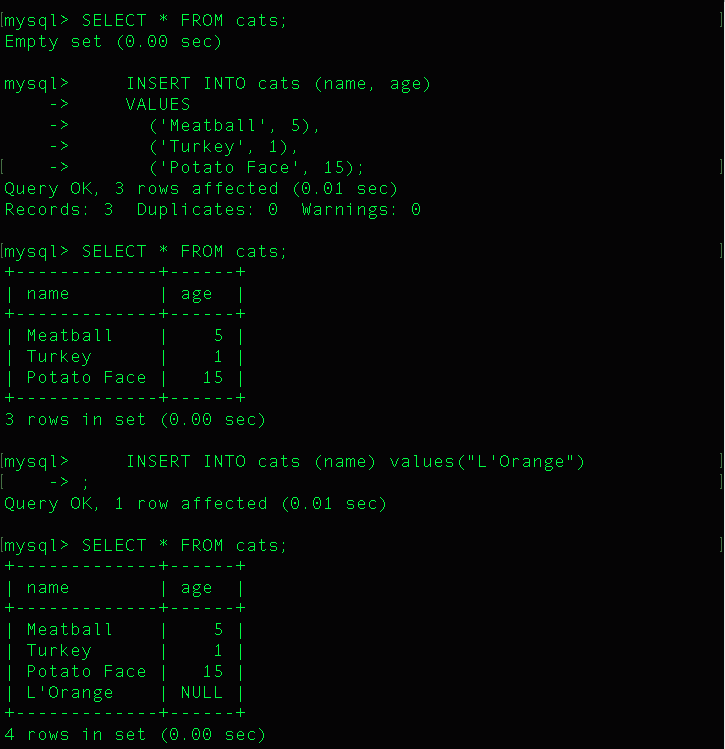

show databases;

- To list available databases:

  ```
  show databases;
  ```

- The general command for creating a database:

  ```
  CREATE DATABASE <database_name>;
  ```

- To drop a database:

  ```
  ROP DATABASE <database-name>;
  ```

- To use a database:

  ```
  USE <database-name>;
  ```

- Create a table:

  ```
    CREATE TABLE cats (
      name VARCHAR(50),
      age INT
    );

    CREATE TABLE dogs (
      name VARCHAR(50),
      breed VARCHAR(50),
      age INT
    );
  ```

- Single insert (switching order of name and age)

  ```
    INSERT INTO cats (age, name)
    VALUES
      (2, 'Beth');
  ```

- Multiple Insert:

  ```
    INSERT INTO cats (name, age)
    VALUES
      ('Meatball', 5),
      ('Turkey', 1),
      ('Potato Face', 15);
  ```

- Describe a table:

  ```
    DESCRIBE cats;
  ```

  

- Insert into cats table only one value out of two specified columns:

  ```
    INSERT INTO cats (name)
    VALUES
      ('Misty');
  ```

  

- Insert no values:

  ```
    INSERT INTO cats
    VALUES
      ();
  ```

  

- NOT NULL:

  ```
    CREATE TABLE cats2 (
     name VARCHAR(100) NOT NULL,
     age INT NOT NULL
    );
  ```

  
